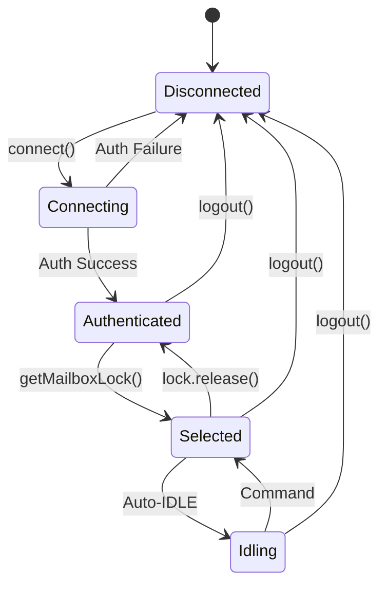
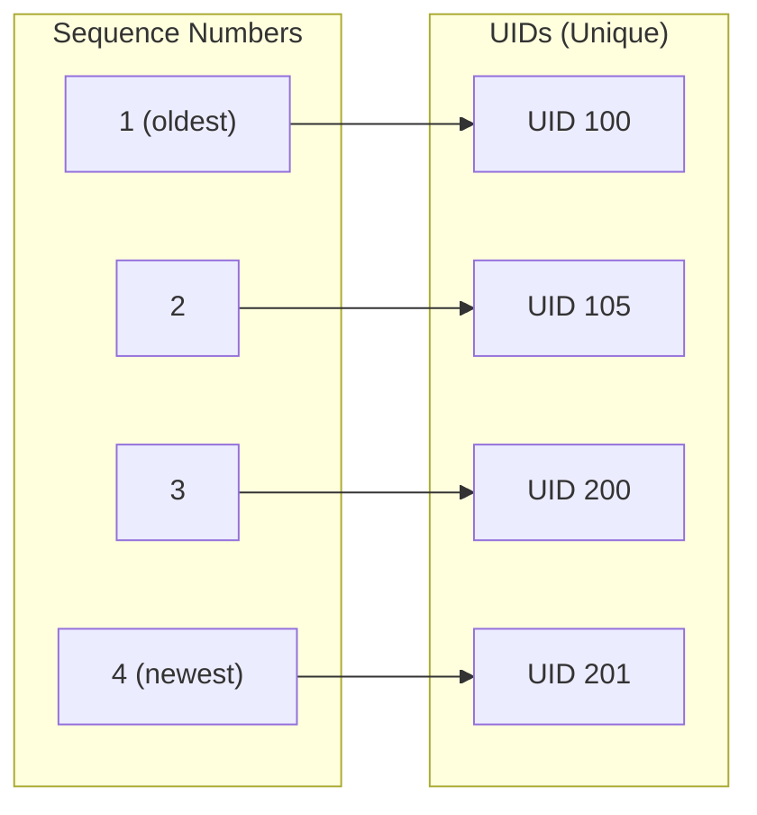

# Basic Usage

This guide covers the fundamental concepts and patterns for using ImapFlow.

## The ImapFlow Client

The `ImapFlow` class is the main entry point for all IMAP operations. Each instance represents a single IMAP connection.

```js
const { ImapFlow } = require('imapflow');

const client = new ImapFlow({
    host: 'imap.example.com',
    port: 993,
    secure: true,
    auth: {
        user: 'user@example.com',
        pass: 'password'
    }
});
```

## Connection Lifecycle



### Connecting

Always connect before performing any operations:

```js
await client.connect();
console.log('Connected successfully');
console.log('Server capabilities:', client.capabilities);
```

### Connection States

The client transitions through these states:

| State | Description | Available Operations |
|-------|-------------|---------------------|
| Disconnected | Not connected to server | `connect()` only |
| Authenticated | Logged in, no mailbox | `list()`, `status()`, `getMailboxLock()` |
| Selected | Mailbox is open | All operations including `fetch()`, `search()` |
| Idling | Waiting for server notifications | Events fire, any command breaks IDLE |

### Logging Out

Always close the connection when done:

```js
await client.logout();
```

For immediate disconnection without LOGOUT command:

```js
client.close();
```

### Handling Disconnections

ImapFlow does **not** automatically reconnect when the connection is lost. You must implement your own reconnection logic:

```js
client.on('close', () => {
    console.log('Connection closed');
    // Implement reconnection logic here
});
```

:::warning No Auto-Reconnect
If the connection drops due to network issues, server timeout, or any other reason, ImapFlow will not attempt to reconnect. Your application is responsible for detecting the disconnection (via the `close` event) and establishing a new connection if needed.
:::

## Working with Mailboxes

### Mailbox Locks

ImapFlow uses a locking mechanism to ensure safe concurrent access to mailboxes. This is the recommended way to work with mailboxes:

```js
let lock = await client.getMailboxLock('INBOX');
try {
    // Perform mailbox operations
    // The mailbox remains selected and locked
    console.log(`${client.mailbox.exists} messages`);
} finally {
    // Always release the lock
    lock.release();
}
```

:::warning Always Release Locks
Always release locks in a `finally` block to prevent deadlocks. If a lock is not released, subsequent `getMailboxLock()` calls will wait indefinitely.
:::

### Why Use Locks?

Without locks, another part of your code could switch mailboxes while you're in the middle of an operation:

```js
// Without locks - UNSAFE
await client.mailboxOpen('INBOX');
// ... another async operation could call mailboxOpen('Sent') here ...
let message = await client.fetchOne('*', { envelope: true });  // Wrong mailbox!

// With locks - SAFE
let lock = await client.getMailboxLock('INBOX');
try {
    let message = await client.fetchOne('*', { envelope: true });  // Correct!
} finally {
    lock.release();
}
```

### Mailbox Information

When a mailbox is locked, the `client.mailbox` property contains information about the selected mailbox:

```js
let lock = await client.getMailboxLock('INBOX');
try {
    console.log('Path:', client.mailbox.path);
    console.log('Total messages:', client.mailbox.exists);
    console.log('UID of next message:', client.mailbox.uidNext);
    console.log('UIDVALIDITY:', client.mailbox.uidValidity);
    console.log('Highest modseq:', client.mailbox.highestModseq);
    console.log('Read-only mode:', client.mailbox.readOnly);
    console.log('Permanent flags:', client.mailbox.permanentFlags);
} finally {
    lock.release();
}
```

## Understanding Message Identifiers

IMAP uses two types of message identifiers:



### Sequence Numbers

Sequential numbers from 1 to N, where N is the number of messages in the mailbox. These change when messages are deleted.

```js
// Fetch message with sequence number 1 (oldest message)
let oldest = await client.fetchOne('1', { envelope: true });

// Fetch the last message (newest)
let latest = await client.fetchOne('*', { envelope: true });
```

### UIDs (Unique Identifiers)

Permanent identifiers that don't change within a UIDVALIDITY period. Always use UIDs for reliable message tracking.

```js
// Fetch by UID - use third parameter for options
let message = await client.fetchOne('12345', { envelope: true }, { uid: true });

// The message object always includes both seq and uid
console.log('Sequence:', message.seq);
console.log('UID:', message.uid);
```

### UIDVALIDITY

The UIDVALIDITY value identifies when UIDs were assigned. If this value changes (rare), all cached UIDs are invalid:

```js
let lock = await client.getMailboxLock('INBOX');
try {
    let currentValidity = client.mailbox.uidValidity;

    // Compare with cached value
    if (currentValidity !== cachedValidity) {
        console.log('UID validity changed - cache is invalid');
        // Clear cached UIDs and re-fetch
    }
} finally {
    lock.release();
}
```

## Message Ranges

ImapFlow supports various range formats for specifying messages:

```js
// Single message
'1'           // Message with sequence number 1
'12345'       // Message with sequence/UID 12345

// Range of messages
'1:10'        // Messages 1 through 10
'100:*'       // Message 100 to the last message

// Multiple ranges
'1,3,5'       // Messages 1, 3, and 5
'1:5,10:15'   // Messages 1-5 and 10-15

// Special ranges (ImapFlow extensions)
'*'           // Last message only
'*:-10'       // Last 10 messages

// Array of numbers
[1, 2, 3, 10, 20]  // Specific messages

// Search object (resolves to matching messages)
{ seen: false }    // All unseen messages
```

## Events

ImapFlow emits events for real-time notifications:

```js
// Connection events
client.on('close', () => {
    console.log('Connection closed');
    // ImapFlow does NOT auto-reconnect
});

client.on('error', (err) => {
    console.error('Connection error:', err);
});

// Mailbox events (only when mailbox is selected)
client.on('exists', (data) => {
    console.log(`New message count: ${data.count}`);
});

client.on('expunge', (data) => {
    console.log(`Message ${data.seq} was deleted`);
});

client.on('flags', (data) => {
    console.log(`Flags changed for message ${data.seq}`);
});

// Mailbox open/close events
client.on('mailboxOpen', (mailbox) => {
    console.log(`Opened ${mailbox.path}`);
});

client.on('mailboxClose', (mailbox) => {
    console.log(`Closed ${mailbox.path}`);
});
```

## Promises and Async/Await

All ImapFlow methods are promise-based. Always use `await` or `.then()`:

```js
// Using async/await (recommended)
async function fetchLatestMessage() {
    await client.connect();

    let lock = await client.getMailboxLock('INBOX');
    try {
        let message = await client.fetchOne('*', { envelope: true });
        return message;
    } finally {
        lock.release();
    }
}

// Using promises
client.connect()
    .then(() => client.getMailboxLock('INBOX'))
    .then(lock => {
        return client.fetchOne('*', { envelope: true })
            .finally(() => lock.release());
    })
    .then(message => {
        console.log(message.envelope.subject);
    });
```

## Error Handling

Always wrap IMAP operations in try/catch blocks:

```js
async function main() {
    try {
        await client.connect();

        let lock = await client.getMailboxLock('INBOX');
        try {
            let message = await client.fetchOne('*', { envelope: true });
            console.log(message.envelope.subject);
        } finally {
            lock.release();
        }

        await client.logout();
    } catch (err) {
        console.error('IMAP Error:', err.message);
        console.error('Error code:', err.code);

        // Handle specific errors
        if (err.authenticationFailed) {
            console.error('Invalid credentials');
        }

        if (err.code === 'NoConnection') {
            console.error('Not connected to server');
        }

        if (err.responseStatus === 'NO') {
            console.error('Server rejected the command');
        }
    }
}
```

### Common Error Codes

| Code | Description |
|------|-------------|
| `NoConnection` | Not connected to server |
| `CONNECT_TIMEOUT` | Connection timed out |
| `GREETING_TIMEOUT` | Server greeting not received |
| `EConnectionClosed` | Connection was closed unexpectedly |

## Complete Example

```js
const { ImapFlow } = require('imapflow');

async function main() {
    const client = new ImapFlow({
        host: 'imap.example.com',
        port: 993,
        secure: true,
        auth: {
            user: 'user@example.com',
            pass: 'password'
        },
        logger: false  // Disable logging for cleaner output
    });

    // Handle connection events
    client.on('error', err => {
        console.error('Connection error:', err);
    });

    client.on('close', () => {
        console.log('Connection closed');
    });

    try {
        // Connect
        await client.connect();
        console.log('Connected to', client.host);

        // List mailboxes
        let mailboxes = await client.list();
        console.log('Available mailboxes:');
        for (let mailbox of mailboxes) {
            console.log(`  ${mailbox.path} ${mailbox.specialUse || ''}`);
        }

        // Work with INBOX
        let lock = await client.getMailboxLock('INBOX');
        try {
            console.log(`\nINBOX has ${client.mailbox.exists} messages`);

            if (client.mailbox.exists > 0) {
                // Fetch latest message
                let message = await client.fetchOne('*', {
                    envelope: true,
                    flags: true
                });

                console.log('\nLatest message:');
                console.log('  Subject:', message.envelope.subject);
                console.log('  From:', message.envelope.from[0]?.address);
                console.log('  Date:', message.envelope.date);
                console.log('  Read:', message.flags.has('\\Seen'));
            }
        } finally {
            lock.release();
        }

        // Logout
        await client.logout();
        console.log('\nDisconnected');

    } catch (err) {
        console.error('Error:', err);
        client.close();
    }
}

main();
```

## Best Practices

1. **Always release locks** - Use `finally` blocks to ensure locks are released
2. **Use UIDs** - Prefer UIDs over sequence numbers for message operations
3. **Handle errors** - Wrap all IMAP operations in try/catch
4. **Close connections** - Always call `logout()` when done
5. **One operation at a time** - Don't perform multiple operations simultaneously without proper locking
6. **Handle reconnection** - ImapFlow does not auto-reconnect; implement your own logic
7. **Use fetchAll() for modifications** - If you need to modify messages after fetching, use `fetchAll()` instead of `fetch()`

## Next Steps

- Learn about [Configuration Options](./configuration.md)
- Explore [Fetching Messages](./fetching-messages.md)
- Understand [Searching](./searching.md)
- See [Mailbox Management](./mailbox-management.md)
